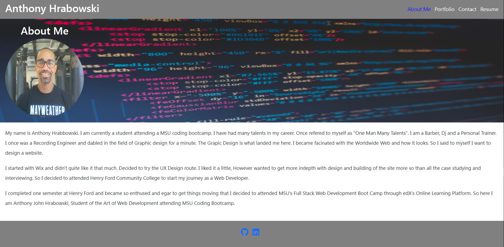

# Portfolio-R

## Badges

## Table of Contents

- [License](#license)
- [Description](#description)
- [Installation](#installation)
- [Usage](#usage)
- [Contact Info](#contact-info)

## License

Read more about MIT here:
[MIT](https://opensource.org/licenses/MIT)

## Description

This is a project assignment for my MSU Fullstack Web Development Bootcamp. My task was to create a portfolio using my new React skills, which will help me set myself apart from other developers whose portfolios don’t use the latest technologies.

## Installation

Required applications:
- Visual Studio Code: (https://code.visualstudio.com/)
- Express.js: (https://www.npmjs.com/package/express)
- React: (https://react.dev/)
- Git for MAC/Windows/Linux: (https://git-scm.com/downloads)

## Usage

To use, first download the above required applications in [Installation](#installation).

- Clone the repository to your local machine.
- After cloning the repository, open the directory using Visual Studio Code. 

## Contact Info: 

* ajhrabowski@gmail.com
* https://github.com/Ajhrabowski